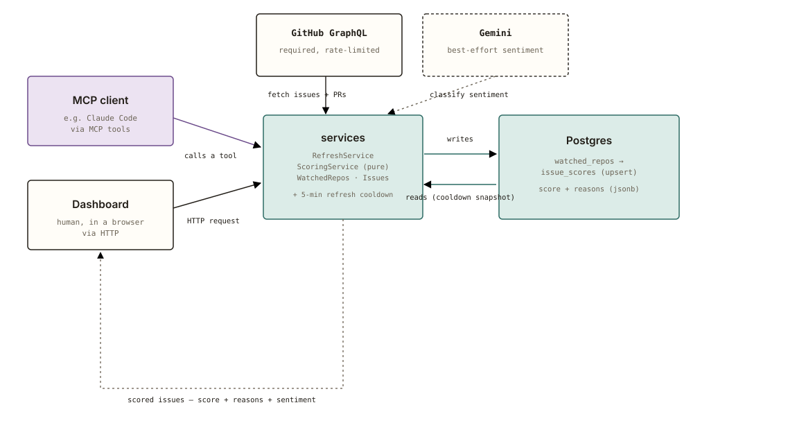

# contrib-radar

contrib-radar scores "good first issue" candidates by whether they're
**actually** available right now — not just whether they carry the label.
It checks the signals a contributor would otherwise have to check by hand:
is there already an assignee, is there a competing or abandoned PR, how
stale is the issue, and — the part no label-aggregator does — what does a
*maintainer* actually think about it, read from their own comments.

This exists because verifying ~40 "good first issue" candidates across 5
CNCF/LF projects by hand, in one sitting, took hours: cross-checking
assignees, searching for competing PRs, and reading full comment threads
just to find the one maintainer reply that mattered. Every existing tool
in this space ([goodfirstissue.dev](https://goodfirstissue.dev),
[up-for-grabs.net](https://up-for-grabs.net), and similar) only aggregates
by label — none of them verify availability or read the room.

## How scoring works

Every issue gets a score from 0-100 (`base 100`, penalties subtracted,
clamped) plus a list of **reasons**, each carrying a severity
(`positive`/`info`/`warning`/`negative`) and the exact point delta it
contributed — ordered by impact, so the reason that mattered most is
always first:

| Signal | What it checks |
|---|---|
| Assignee | Present and recently active (heavy penalty) vs. present but stale (light penalty) |
| Competing PRs | Open PRs referencing the issue (capped penalty); a **merged** one is treated as near-certain resolution |
| Abandoned attempts | Closed-without-merging PRs — a real difficulty signal, not noise |
| Staleness | Tiered penalty by days since the issue last moved |
| Blocking labels | `wontfix`, `duplicate`, `invalid`, `blocked` |
| Maintainer sentiment | Gemini classifies *only* comments from OWNER/MEMBER/COLLABORATOR authors into `encouraged` / `neutral` / `discouraged` / `stale_or_duplicate` |

Sentiment is enrichment, never a requirement: if there are no maintainer
comments, or Gemini is unreachable or misconfigured, or misbehaves and
returns something outside its 4-label schema, scoring falls back to the
deterministic signals alone with a `SENTIMENT_UNAVAILABLE` reason instead
of failing the request. A schema-valid response is still re-validated
against the enum before being trusted — structured output narrows the
*shape* of a bad answer, not the odds of getting one.

## Quickstart

```bash
git clone <this-repo>
cd contrib-radar
npm install
docker compose up -d          # Postgres 17, one container
cp .env.example .env
npm run db:migrate            # applies every migration in drizzle/
npm run start:dev
```

The server starts on `http://localhost:3000`. A `GITHUB_TOKEN` in `.env` is
required — GitHub's GraphQL API has no anonymous tier (any personal access
token with public read scope works). A `GEMINI_API_KEY` is optional: without
one, every issue still scores, just without a sentiment reason.

### Try it

```bash
# Watch a repo
curl -X POST localhost:3000/repos \
  -H 'Content-Type: application/json' \
  -d '{"owner": "fluxcd", "name": "source-controller"}'

# Refresh it (fetches issues, scores them, upserts the snapshot)
curl -X POST localhost:3000/repos/<id>/refresh

# Read the scored issues back, highest-opportunity first
curl localhost:3000/repos/<id>/issues
```

## API

| Method | Path | Does |
|---|---|---|
| `GET` | `/` | Redirects to `/dashboard` |
| `GET` | `/repos` | List every watched repo |
| `POST` | `/repos` | Watch a repo (`{ owner, name, labelFilter? }`) — idempotent |
| `GET` | `/repos/:id` | Read one watched repo |
| `DELETE` | `/repos/:id` | Stop watching a repo — its scored issues cascade with it |
| `POST` | `/repos/:id/refresh` | Refresh scored issues — a 5-minute cooldown returns the cached snapshot instead of re-hitting GitHub/Gemini |
| `GET` | `/repos/:id/issues?sort=` | List the current scored snapshot, `score` (default) or `updated` |
| `GET` | `/health` | Database connectivity + GitHub token / sentiment provider config — `503` if the database is unreachable |
| `GET` | `/dashboard` | The visual dashboard — see below |
| `POST` | `/mcp` | [Model Context Protocol](https://modelcontextprotocol.io) server — see below |

Full request/response schemas: `GET /docs` (Swagger UI) once the server is
running.

## Dashboard

`GET /dashboard` is a single self-contained page (no build step, no
framework) — a repo selector, an add-repo form, a Refresh button, and a
sortable table of scored issues with color-coded score badges and a
hoverable icon per reason. ES/EN, swapped client-side. It's the one part
of contrib-radar meant to be opened directly in a browser by a human;
everything else here is meant for a tool or an agent.

## MCP

| Tool | Does |
|---|---|
| `list_watched_repos` | List every watched repo |
| `add_watched_repo` | Watch a repo — idempotent |
| `refresh_repo` | Refresh scored issues (same 5-minute cooldown as the REST endpoint) |
| `list_scored_issues` | Read the current scored snapshot |
| `check_issue_feasibility` | **Score one issue live, right now** — no watching, no caching, no cooldown. The single call that answers "is this issue actually still available, and does a maintainer actually want it worked on?" for any repo, even one nobody's watching yet |

Point any MCP client at `POST /mcp` (Streamable HTTP transport, stateless —
a fresh session per request, no server-side state to manage).

## Architecture

<picture>
  <source media="(prefers-color-scheme: dark)" srcset="docs/architecture-dark.svg">
  
</picture>

```
src/
  database/   Postgres schema (Drizzle, drizzle-kit-managed migrations)
  watched-repos/  CRUD for the repos being tracked
  github/     GithubClient interface + the GraphQL reference implementation
  scoring/    pure functions - no DB, no network - one signal per file + weights.ts
  sentiment/  SentimentProvider interface + the Gemini reference implementation, classifySafely
  refresh/    orchestrates github -> scoring -> sentiment -> upsert, with the cooldown
  issues/     GET /repos/:id/issues - reads the scored snapshot
  dashboard/  GET /dashboard - the self-contained UI
  mcp/        POST /mcp - the tools above, over Model Context Protocol
  health/     GET /health
  logging/    structured JSON request logging, one line per request
  common/     shared rate limiter (GitHub GraphQL and Gemini each get their own instance)
```

Storage is Postgres via [Drizzle ORM](https://orm.drizzle.team). Migrations
are generated, not hand-written: `npm run db:generate` diffs
`src/database/schema.ts` against `drizzle/` and writes the SQL;
`npm run db:migrate` applies whatever hasn't run yet. Nothing migrates
automatically on boot — that's a separate, explicit step, so multiple app
instances never race to alter the same live schema on startup.

**Provider interfaces** are the extension points for both external APIs:
`GithubClient` (`src/github/github-client.interface.ts`) and
`SentimentProvider` (`src/sentiment/sentiment-provider.interface.ts`) are
each a small interface with one reference implementation, so scoring and
refresh never talk to `fetch` or a specific vendor directly — swapping in
a different LLM for sentiment, or a REST-based GitHub client, means
writing one class.

## Contributing

See [CONTRIBUTING.md](CONTRIBUTING.md). Short version: real tests over
mocked ones (except the two external APIs, which are always mocked),
Conventional Commits, and every PR passing CI before review.

## License

[MIT](LICENSE)
